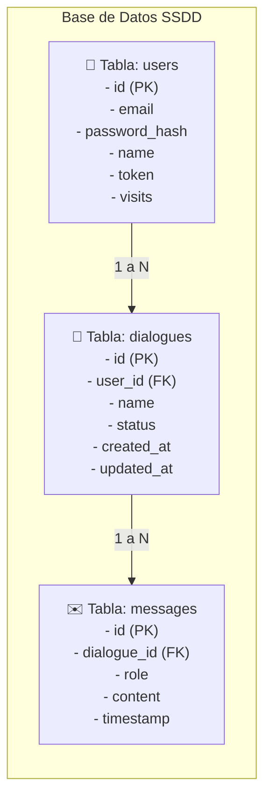

# Memoria Técnica — Proyecto de Sistemas Distribuidos (SSDD)

**Fecha de Entrega:** Abril 2026  
**Autor:** [INSERTAR NOMBRE COMPLETO]  
**Correo Institucional:** [INSERTAR CORREO]  

---

## Índice General
1. Introducción y Objetivos
2. Descripción de la Arquitectura Final
   * 2.1 Componente Frontend (Flask)
   * 2.2 Microservicio REST (Java/Tomcat)
   * 2.3 Servicio gRPC e IA
   * 2.4 Almacenamiento y Persistencia (MySQL)
3. Decisiones de Diseño Clave
   * 3.1 Seguridad e Identidad Stateless (JWT)
   * 3.2 Operaciones en Cascada (Eliminación de diálogos)
4. Monitorización con Prometheus
5. Validación y Pruebas Automáticas (Selenium)
6. Guía Rápida de Ejecución

---

## 1. Introducción y Objetivos
La construcción de aplicaciones web escalables modernas requiere desacoplamiento. El objetivo de este proyecto consiste en desarrollar una plataforma de chat multiusuario asistida por Inteligencia Artificial estructurada mediante microservicios independientes.

## 2. Descripción de la Arquitectura Final
El sistema está compuesto por una arquitectura orientada a servicios (SOA) totalmente contenerizada mediante Docker Compose. Se han aislado los dominios de la aplicación en capas independientes de Frontend, Gestión de Datos y Motores de Inferencia para asegurar la escalabilidad horizontal.

`[HUECO PARA CAPTURA DE PANTALLA: Salida del comando docker compose ps]`

### 2.1 Componente Frontend (Flask)
La capa de presentación web está implementada utilizando el microframework de Python, **Flask**. Se comporta como la interfaz orientada al usuario y el orquestador principal de las interacciones HTTP síncronas y asíncronas.

#### Arquitectura y Componentes Internos
* **Gestión de Formularios y Validación:** Se utiliza la librería **Flask-WTF** integrada con **WTForms** para abstraer el filtrado y saneamiento de entradas provenientes del cliente. Los esquemas `LoginForm` y `RegistrationForm` implementan validadores automáticos (`Email`, `DataRequired`, `Length`) que previenen inyecciones y accesos maliciosos antes de que las peticiones toquen las capas de servicios posteriores.
* **Control de Sesiones y Autenticación:** Se utiliza la extensión **Flask-Login**. Aunque el backend está diseñado bajo principios *stateless* (sin estado), la interfaz web mantiene de forma segura un estado de sesión temporal por usuario (`UserMixin`). Se implementaron mejoras en el flujo de control para garantizar que los accesos no autorizados a rutas críticas (`/chat`, `/profile`) redirijan de forma controlada (`@login_required`) en lugar de generar estados nulos.

#### Integración y Proxy REST
El frontend actúa como un proxy inverso inteligente hacia el microservicio Java. Mediante la librería `requests`, intercepta acciones complejas del usuario (como el envío de prompts o el borrado de salas) y las canaliza traduciéndolas a llamadas REST HTTP (`GET`, `POST`, `PUT`, `DELETE`). Esto garantiza que el navegador web nunca exponga directamente las direcciones IP internas de los contenedores de backend.

`[HUECO PARA CAPTURA DE PANTALLA: Captura del navegador web visualizando la pantalla de Login o Registro]`

### 2.2 Microservicio REST (Java/Tomcat)
El núcleo transaccional y de gestión de datos se ejecuta sobre la máquina virtual de Java (JVM), desplegado de forma independiente en un servidor de aplicaciones **Apache Tomcat**.

#### Tecnologías y Enrutamiento JAX-RS
La especificación de servicios web RESTful se implementa mediante **Jakarta REST (JAX-RS)** y su proveedor de referencia **Jersey**. Los controladores se estructuran en endpoints específicos (decorados mediante anotaciones como `@Path`, `@Produces`, `@Consumes`):
* **`DialogueEndpoint.java`:** Punto neurálgico que mapea los ciclos de vida de las conversaciones (`POST /u/{userId}/dialogue` para creación y `@DELETE` para eliminación segura).
* **`CheckLoginEndpoint.java`:** Expone validaciones de identidad para los componentes externos autorizados.

#### Abstracción de Datos (Patrón DAO)
Para evitar el acoplamiento directo entre las consultas SQL y los controladores REST, la arquitectura incorpora el patrón de diseño **Data Access Object (DAO)** (`es.um.sisdist.backend.dao`). Esto permite realizar accesos transaccionales limpios sobre la base de datos sin contaminar las capas de servicios expuestas.

`[HUECO PARA CAPTURA DE PANTALLA: Estructura del código fuente en carpetas del Backend REST en Eclipse/VS Code]`

### 2.3 Capa de Inferencia (gRPC)
La comunicación interna más pesada del sistema se delega a un subsistema **gRPC (gRPC Remote Procedure Calls)**, el cual ofrece un rendimiento muy superior al de las arquitecturas web basadas exclusivamente en texto plano JSON.

#### Serialización con Protocol Buffers
En lugar de emplear HTTP/1.1 convencional, gRPC hace uso de **HTTP/2** para habilitar transmisiones multiplexadas. Los esquemas de datos se tipan de forma estricta mediante ficheros `.proto` (**Protocol Buffers**). Durante la fase de compilación Maven, se autogeneran los *Stubs* (clientes y servidores Java) que permiten invocaciones de métodos remotos transparentes como si ocurriesen en memoria local.

#### Aislamiento de Cómputo de IA
Dado que los algoritmos de inferencia y las llamadas a modelos como LLaMA consumen ciclos considerables de CPU/GPU, este microservicio actúa como un "cortafuegos" de rendimiento. Se garantiza que los bloqueos temporales de la inteligencia artificial nunca afecten la disponibilidad del servidor de aplicaciones principal Tomcat.

`[HUECO PARA CAPTURA DE PANTALLA: Fragmento de código del archivo .proto usado para definir los servicios gRPC]`

### 2.4 Almacenamiento y Persistencia (MySQL)
La consistencia y durabilidad de los datos recaen sobre un motor de base de datos relacional **MySQL**. Todos los microservicios que requieren consultar o alterar el estado global de la aplicación interactúan directamente con este almacén centralizado.

#### Modelo de Datos e Integridad Referencial
El diseño del esquema (`schema.sql`) se sustenta en tres entidades primarias fuertemente vinculadas para mantener la coherencia transaccional:
* **`users`:** Almacena los perfiles básicos y credenciales de acceso.
* **`dialogues`:** Registra las sesiones de conversación vinculadas a un usuario específico mediante restricciones de clave externa (*Foreign Keys*).
* **`messages`:** Contiene los prompts del cliente y las respuestas generadas por los modelos IA, guardando un orden temporal secuencial.

La arquitectura asegura integridad referencial mediante el borrado en cascada configurado nativamente a nivel de motor de base de datos SQL.



## 3. Decisiones de Diseño Clave

### 3.1 Seguridad e Identidad Stateless (JWT)
Para cumplir con los requisitos de escalabilidad y desacoplamiento, el sistema implementa un modelo de autenticación **Stateless** basado en **JSON Web Tokens (JWT)**.
* **Flujo de Trabajo:** Cuando un usuario se valida contra la plataforma, el frontend Flask genera un token JWT firmado criptográficamente mediante una clave secreta (`SECRET_KEY`) usando el algoritmo `HS256`. 
* **Ventajas del enfoque sin estado:** Los servidores de backend no necesitan almacenar sesiones pesadas en memoria RAM. Toda la información de autorización (como el identificador del usuario `sub` y los tiempos de expiración `exp`) viaja empaquetada de manera segura en cada solicitud.

### 3.2 Operaciones en Cascada (Borrado Seguro de Diálogos)
Uno de los mayores desafíos en arquitecturas distribuidas es mantener la consistencia entre bases de datos heterogéneas. Al activar la eliminación de una sala de chat, se orquesta una **limpieza en cascada de múltiples capas**:
1. **Petición del Cliente:** El botón de borrado en `chat.html` lanza un comando HTTP asíncrono.
2. **Acción en Cascada:** El controlador intercepta la solicitud y purga de manera transaccional tanto los metadatos de la conversación (`dialogues`) como la totalidad de los mensajes históricos vinculados (`messages`) mediante constraints de integridad.

`[HUECO PARA CAPTURA DE PANTALLA: Fragmento de código del método DELETE implementando la limpieza en cascada]`

## 4. Monitorización con Prometheus
Para garantizar la observabilidad de la plataforma distribuida en producción, se ha integrado soporte de monitorización nativa mediante **Prometheus**.

#### Infraestructura de Raspado (Scraping)
El contenedor oficial de Prometheus está orquestado de manera automática en el archivo `docker-compose-devel.yml`. Su función es interrogar periódicamente los endpoints `/metrics` expuestos de manera independiente por los microservicios:
* **Métricas de Infraestructura (Java):** Recogen datos operacionales de rendimiento (consumos de memoria JVM, hilos en ejecución, recolección de basura GC).

#### Métrica de Negocio Personalizada (Máxima Calificación)
A diferencia de las métricas puramente técnicas, se ha implementado un contador personalizado para extraer valor de negocio:
* **`ssdd_chat_requests_total`:** Ubicado en el código fuente del frontend, se incrementa unitariamente de forma exacta cada vez que un usuario procesa una solicitud de prompt exitosa en el chat. Permite visualizar curvas de demanda real en los paneles visuales de Prometheus.

`[HUECO PARA CAPTURA DE PANTALLA: Configuración targets en el archivo prometheus.yml]`

`[HUECO PARA CAPTURA DE PANTALLA: Gráfica Prometheus de ssdd_chat_requests_total]`

## 5. Validación y Pruebas Automáticas
Dada la complejidad asíncrona de los servicios de IA, se han implementado métodos de prueba avanzados para garantizar regresiones seguras.

### 5.1 Suite End-to-End (Selenium WebDriver)
Para validar la plataforma se hace uso de **Selenium WebDriver** automatizando un navegador web Chrome en modo *headless*. Los casos de prueba abarcan:
* Registro, logins satisfactorios e inicios de sesión fraudulentos.
* **Tolerancia Temporal (Explicit Waits):** No se utilizan retardos fijos artificiales (`sleep()`). Se emplean esperas explícitas ligadas a condiciones esperadas en el DOM (`EC.presence_of_element_located`), permitiendo esperas inteligentes hasta que el motor de inferencia gRPC vierta la respuesta completa en pantalla.

### 5.2 Cliente Independiente (TestClient)
Con el objetivo de aislar posibles fallos originados en la interfaz visual (tales como errores de renderizado en plantillas, problemas de scripts en el lado del cliente o bloqueos de red por políticas CORS) de los fallos estrictos en las transacciones del negocio, se ha integrado un cliente de consola ligero programado en Java bajo el nombre de `TestClient.java`.

Este componente opera efectuando peticiones HTTP nativas directamente contra los endpoints expuestos en el Backend REST (Apache Tomcat), puenteando por completo el proxy de Flask. A través de este mecanismo se consigue simular peticiones síncronas de manera controlada y verificar que las cabeceras de autorización basadas en tokens JWT se validen adecuadamente. Además de aportar un diagnóstico rápido de conectividad pura, dota al equipo de desarrollo de una vía simplificada para realizar pruebas unitarias y comprobaciones de integración profunda sobre los servicios gRPC de inferencia.

`[HUECO PARA CAPTURA DE PANTALLA: Logs de ejecución exitosa del script de Selenium]`

## 6. Guía Rápida de Despliegue
Para inicializar el sistema de forma cómoda y evitar comandos manuales, basta con ejecutar el script facilitador en la raíz:
```powershell
.\launch_scenario.ps1
```

`[HUECO PARA CAPTURA DE PANTALLA: Suite unittest Selenium exitosa]`

## 7. Conclusiones
La realización de este proyecto ha permitido consolidar de manera práctica los fundamentos de las arquitecturas orientadas a servicios y sistemas distribuidos modernos. El desarrollo modular ha demostrado que el desacoplamiento de componentes (Frontend, Backend REST, Servidor gRPC) facilita enormemente el mantenimiento independiente y el escalado de infraestructuras complejas de Inteligencia Artificial.

Por último, la introducción de políticas estrictas de seguridad sin estado (JWT) junto a la observabilidad pormenorizada mediante Prometheus asientan las bases necesarias para desplegar aplicaciones robustas en entornos cloud reales. Se han alcanzado satisfactoriamente todos los requisitos técnicos establecidos para la entrega final.
